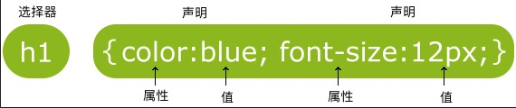

# CSS(Cascading Style Sheets)
* CSS 指层叠样式表 (Cascading Style Sheets)
* 样式定义如何显示 HTML 元素
* 样式通常存储在样式表中
* 把样式添加到 HTML 4.0 中，是为了解决内容与表现分离的问题
* 外部样式表可以极大提高工作效率
* 外部样式表通常存储在 CSS 文件中
* 多个样式定义可层叠为一个

 **CSS 实例** 

 CSS 规则由两个主要的部分构成：选择器，以及一条或多条声明


选择器通常是您需要改变样式的 HTML 元素。
每条声明由一个属性和一个值组成。属性（property）是您希望设置的样式属性（style attribute）。每个属性有一个值。属性和值被冒号分开。
[CSS 语法](https://www.runoob.com/css/css-syntax.html)


##CSS Id 和 Class
**id 和 class 选择器**

如果你要在HTML元素中设置CSS样式，你需要在元素中设置 `id` 和 `class`选择器。

**id 选择器** 

id 选择器可以为标有特定 id 的 HTML 元素指定特定的样式。
HTML元素以id属性来设置id选择器,CSS 中 id 选择器以 `#` 来定义。

**注意：ID属性不要以数字开头，数字开头的ID在 Mozilla/Firefox 浏览器中不起作用。**

id选择器的例子

```
<!DOCTYPE html>
<html>
<head>
<meta charset="utf-8"> 
<title>菜鸟教程(runoob.com)</title> 
<style>
#para1
{
	text-align:center;
	color:red;
} 
</style>
</head>

<body>
<p id="para1">Hello World!</p>
<p>这个段落不受该样式的影响。</p>
</body>
</html>
```

**class 选择器**
class 选择器用于描述一组元素的样式，class 选择器有别于id选择器，class可以在多个元素中使用。
class 选择器在HTML中以class属性表示, 在 CSS 中，类选择器以一个点`.`号显示

class选择器的例子
```
<!DOCTYPE html>
<html>
<head>
<meta charset="utf-8"> 
<title>菜鸟教程(runoob.com)</title> 
<style>
.center
{
	text-align:center;
}
</style>
</head>

<body>
<h1 class="center">标题居中</h1>
<p class="center">段落居中。</p> 
</body>
</html>
```
**注意：类名的第一个字符不能使用数字！它无法在 Mozilla 或 Firefox 中起作用。**

**你也可以指定特定的HTML元素使用class**
比如这个例子中，只指定 `p`标签的文本居中
```
<!DOCTYPE html>
<html>
<head>
<meta charset="utf-8"> 
<title>菜鸟教程(runoob.com)</title> 
<style>
p.center
{
	text-align:center;
}
</style>
</head>

<body>
<h1 class="center">这个标题不受影响</h1>
<p class="center">这个段落居中对齐。</p> 
</body>
</html>
```

## CSS创建
当读到一个样式表时，浏览器会根据它来格式化 HTML 文档。

**如何插入样式表**

插入样式表的方法有三种:
* 外部样式表(External style sheet)
* 内部样式表(Internal style sheet)
* 内联样式(Inline style)
  
**外部样式表**

当样式需要应用于很多页面时，外部样式表将是理想的选择。在使用外部样式表的情况下，你可以通过改变一个文件来改变整个站点的外观。每个页面使用 `<link>` 标签链接到样式表。 `<link>` 标签在（文档的）头部。
```
<head>
<link rel="stylesheet" type="text/css" href="mystyle.css">
</head>
```
浏览器会从文件 mystyle.css 中读到样式声明，并根据它来格式文档。

外部样式表可以在任何文本编辑器中进行编辑。文件不能包含任何的 html 标签。样式表应该以 .css 扩展名进行保存。下面是一个样式表文件的例子：
```
hr {color:sienna;}
p {margin-left:20px;}
body {background-image:url("/images/back40.gif");}
```

**内部样式表**

当单个文档需要特殊的样式时，就应该使用内部样式表。你可以使用 `<style>` 标签在文档头部定义内部样式表，就像这样:

```
<head>
<style>
hr {color:sienna;}
p {margin-left:20px;}
body {background-image:url("images/back40.gif");}
</style>
</head>
```
**内联样式**

由于要将表现和内容混杂在一起，内联样式会损失掉样式表的许多优势。请慎用这种方法，例如当样式仅需要在一个元素上应用一次时。

要使用内联样式，你需要在相关的标签内使用样式`style`属性。`style`属性可以包含任何`CSS`属性。本例展示如何改变段落的颜色和左外边距：
```
<p style="color:sienna;margin-left:20px">这是一个段落。</p>
```
**多重样式**

如果某些属性在不同的样式表中被同样的选择器定义，那么属性值将从更具体的样式表中被继承过来。

例如，外部样式表拥有针对 h3 选择器的三个属性：
```
h3
{
    color:red;
    text-align:left;
    font-size:8pt;
}
```
而内部样式表拥有针对 h3 选择器的两个属性：
```
h3
{
    text-align:right;
    font-size:20pt;
}
```
假如拥有内部样式表的这个页面同时与外部样式表链接，那么 h3 得到的样式是：
```
color:red;
text-align:right;
font-size:20pt;
```
即颜色属性将被继承于外部样式表，而文字排列（text-alignment）和字体尺寸（font-size）会被内部样式表中的规则取代。
**多重样式优先级**
样式表允许以多种方式规定样式信息。样式可以规定在单个的 HTML 元素中，在 HTML 页的头元素中，或在一个外部的 CSS 文件中。甚至可以在同一个 HTML 文档内部引用多个外部样式表。
一般情况下，优先级如下：
(内联样式）Inline style > （内部样式）Internal style sheet >（外部样式）External style sheet > 浏览器默认样式。

*注意：如果外部样式放在内部样式的后面，则外部样式将覆盖内部样式。*

DOM (Document Object Model)（文档对象模型）是用于访问 HTML 元素的正式 W3C 标准。